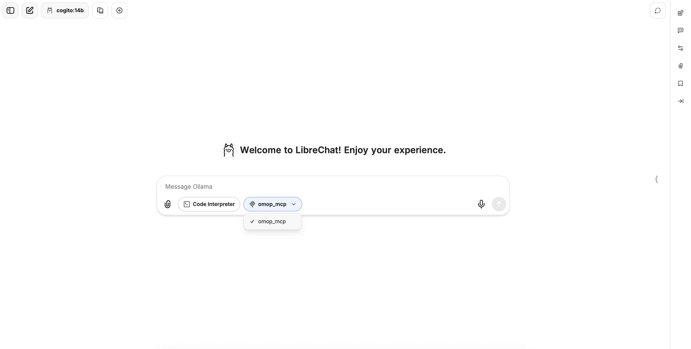

# Installation Guide 🚀

## ⚠️ Pre-Alpha Stage Warning

**OMCP is currently in pre-alpha development stage**. This means:

- Features may change significantly between versions
- Breaking changes can occur without notice
- Documentation may be incomplete or outdated
- Bugs and unexpected behaviors are likely

We appreciate your patience and feedback as we work toward a stable release!

## Installing from GitHub 📦

### Prerequisites

- [Git](https://git-scm.com/)
- [Git LFS](https://git-lfs.com/)
- [uv (Python package installer) ](https://docs.astral.sh/uv/)
    - On MacOS/Linux
    ```bash
    curl -LsSf https://astral.sh/uv/install.sh | sh
    ```
    - On Windows
    ```powershell
    powershell -ExecutionPolicy ByPass -c "irm https://astral.sh/uv/install.ps1 | iex"
    ```

- Python 3.13 or higher (Let UV install and manage python versions within a virtual environment)

### Step 1: Clone the Repository

```bash
git clone https://github.com/fastomop/omcp.git
cd omcp
```

### Step 2: Install the package with dependencies

UV automatically creates the virtual environment with the correct python version and dependencies.

#### With DuckDB Support (Default)

```bash
uv sync --extra duckdb
```

#### With PostgreSQL Support

!!! warning
    Not implemented yet.

```bash
uv sync --extra postgres
```

### Step 3: Activate the virtual environment

```bash
source .venv/bin/activate  # On Windows use: .venv\Scripts\activate
```

## Using the Synthetic Database 🗄️

OMCP comes with a synthetic OMOP database (located at `/synthetic_data/synthea.duckdb`) for testing and development purposes. This database follows the OMOP Common Data Model and contains fictional patient data available at [Synthea](https://synthetichealth.github.io/synthea/).

### Retrieving Synthea.duckdb
Since the database is a rather large file, the actual database has been replaced by a Git LFS pointer, you should see something like this inside `synthea.duckdb`:
```
version https://git-lfs.github.com/spec/v1
oid sha256:d753b619a8650c966ce219daa35b4126fb9307b790e49f0244646cb3b796feab
size 21508096
```

to retrieve the database:

```bash
git lfs install
```
and then:

```bash
git lfs pull
```

### Setting Up the Environment Variable

Create a `.env` file in your project root with the connection string:

```bash
echo 'DB_CONNECTION_STRING="duckdb:///full/path/to/omcp/synthetic_data/synthea.duckdb"' > .env
```

Or set it directly in your environment:

```bash
# Linux/Mac
export DB_CONNECTION_STRING="duckdb:///full/path/to/omcp/synthetic_data/synthea.duckdb"

# Windows (Command Prompt)
set DB_CONNECTION_STRING=duckdb:///full/path/to/omcp/synthetic_data/synthea.duckdb

# Windows (PowerShell)
$env:DB_CONNECTION_STRING="duckdb:///full/path/to/omcp/synthetic_data/synthea.duckdb"
```

### Using the Database for Experiments

The synthetic database contains a complete OMOP CDM schema with fictional patient data. You can:

1. Explore tables like `person`, `condition_occurrence`, `drug_exposure`, etc.
2. Run queries against it to test your applications
3. Use it as a sandbox for learning the OMOP data model

It is easy to do this using the [DuckDB UI](https://duckdb.org/2025/03/12/duckdb-ui.html) by running the following command from the `/synthetic_data` directory.

```bash
duckdb -ui synthea.duckdb
```

!!! warning
    DuckDB does not allow multiple processes to open a connection to the database at the same time when at least one of them has write access.
    To avoid running into problems, close any open connections to the database before running the MCP server.

## Integrating with Claude Desktop 🤖

OMCP provides a Model Context Protocol server that can integrate with Claude Desktop.

### Step 1: Install Claude Desktop

Download and install [Claude Desktop](https://claude.ai/download) from the official website.
On Linux, use https://github.com/aaddrick/claude-desktop-debian/ or similar until an official release becomes available.

### Step 2: Configure Claude Desktop to Use OMCP

1. Open or create the Claude Desktop configuration file:

```bash
# Linux
mkdir -p ~/.config/Claude
nano ~/.config/Claude/claude_desktop_config.json
```

```bash
# macOS
mkdir -p ~/Library/Application\ Support/Claude
nano ~/Library/Application\ Support/Claude/claude_desktop_config.json
```

```cmd
# Windows
notepad %APPDATA%\Claude\claude_desktop_config.json
```

2. Add the following configuration:

```json
{
  "mcpServers": {
    "omop_mcp": {
      "command": "uv",
      "args": [
        "--directory",
        "/ABSOLUTE/PATH/TO/PARENT/FOLDER THAT CONTAINS main.py",
        "run",
        "main.py"
      ]
    }
  }
}
```

Replace `/ABSOLUTE/PATH/TO/PARENT/FOLDER THAT CONTAINS main.py` with the actual path to your OMCP installation.

### Step 3: Launch Claude Desktop

Start Claude Desktop and the OMCP server should automatically be available for use. You can verify the connection by asking Claude to query the OMOP database.

## Integrating with Localhost models 🦙

### Step 1: Install Ollama
Download and install [Ollama](https://ollama.com/) from the official website. To check if Ollama has been installed properly, open a terminal and type:

```bash
ollama --version
```

you should see something like this in your terminal: `ollama version is 0.6.8`

### Step 2: Pull a model from Ollama
Go to the [Ollama models](https://ollama.com/search) and copy the name of the model you want to pull (e.g., cogito:14b), make sure the model you are pulling is compatible with the MCP tooling option. Next, type in the terminal:

```bash
ollama pull cogito:14b
```

The process will take a while depending on the size of the model, but when it finishes type in the terminal:

```bash
ollama list
```

if everything went well, you should see the model you have pulled from Ollama. In my case `cogito:14b`.

### Step 3: End-user interface configuration
We are going to use [Librechat](https://www.librechat.ai/) as the end-user interface.

1. In the OMCP project, navigate to the directory where the `main.py` file is located, go to the function `def main()` and change the `transport` from `stdio` to `sse`.

    ```python
    def main():
    """Main function to run the MCP server."""

      mcp_app.run(
          transport="sse", #before was stdio
      )
    ```

2. In the same directory where `main.py` is located, run the following command:

    ```python
    python main.py
    ```

    You should see something like this in the terminal:
    ```
    INFO:     Started server process [96250]
    INFO:     Waiting for application startup.
    INFO:     Application startup complete.
    INFO:     Uvicorn running on http://0.0.0.0:8000 (Press CTRL+C to quit)
    ```
    This means that we are exposing our MCP Tool in the port `http://0.0.0.0:8000` so other services can consume it.

3. Download and install [Docker Desktop](https://www.docker.com/). Once Docker is installed, open Docker Desktop to ensure it is running.

4. In a separate terminal or IDE window, clone the Librechat repository:

    ```bash
    git clone https://github.com/danny-avila/LibreChat.git
    ```

5. In the Librechat repository, navigate to the project directory and create a configuration `.env` file, you can create the file by:

    ```bash
    cp .env.example .env
    ```

6. In the same project directory, create a `.yaml` file, by:

    ```bash
    cp libreachat.example.yaml librechat.yaml
    ```

7. Add the following code at the end of the `librechat.yaml` file we created above:

    ```yaml
    # MCP servers
     mcpServers:
       omop_mcp:
         # type: sse # type can optionally be omitted
         url: http://host.docker.internal:8000/sse
         timeout: 60000  # 1 minute timeout for this server, this is the default timeout for MCP servers.
    ```

    Additionally, under your `custom` provider section (endpoints), add an Ollama endpoint configuration. Adjust `models.default` to match the models you actually pulled with Ollama:

    ```yaml
    custom:
      endpoints:
        - name: "Ollama"
          apiKey: "ollama"
          baseURL: "http://host.docker.internal:11434/v1/"
          models:
            default: ["cogito:14b","llama3.2:3b", "qwen2.5-coder:3b"]
            fetch: false
          titleConvo: true
          titleModel: "current_model"
          summarize: false
          summaryModel: "current_model"
          forcePrompt: false
          modelDisplayLabel: "Ollama"
          addParams:
            stop:
              - "<|start_header_id|>"
              - "<|end_header_id|>"
              - "<|eot_id|>"
              - "<|reserved_special_token>"
    ```

    Note: Replace the model names in `models.default` with the ones you have downloaded locally via Ollama.

8. In the project directory, run:
    ```bash
    docker compose up -d
    ```
    If successful, you should see something like this:
    ```
    [+] Running 5/5
     ✔ Container vectordb          Started
     ✔ Container chat-meilisearch  Started
     ✔ Container chat-mongodb      Started
     ✔ Container rag_api           Started
     ✔ Container LibreChat         Started
    ```

9. Finally, go to the browser and type `localhost:3080`, if it is the first time using Librechat, you need to create an account. Then select the model you pulled, in my case `cogito:14b` and in the chat, just next to the `Code Interpreter` you should see the MCP Tool, click on it and select `omop_mcp`.

    You should see something like this:
    

## Troubleshooting 🔧

### Common Issues

#### DuckDB Connection Problems

If you encounter errors connecting to the DuckDB database:

1. Verify the file path in your connection string is correct
2. Ensure the database file exists at the specified location
3. Check permissions on the database file

#### Python Version Issues

OMCP requires Python 3.13+. To check your Python version:

```bash
python --version
```

#### Claude Desktop Integration Issues

If Claude Desktop doesn't recognize the OMCP server:

1. Verify the configuration file is in the correct location
2. Ensure the path to main.py is correct
3. Restart Claude Desktop

## Getting Help 💬

If you encounter issues not covered here:

- Open an issue on our [GitHub repository](https://github.com/fastomop/omcp/issues)
- Join our community discussions
- Check the FAQ section in our documentation

## Next Steps 👣

Now that you have OMCP installed and configured:

- Explore the [Contributing Guidelines](./contributing.md) if you'd like to help improve OMCP
