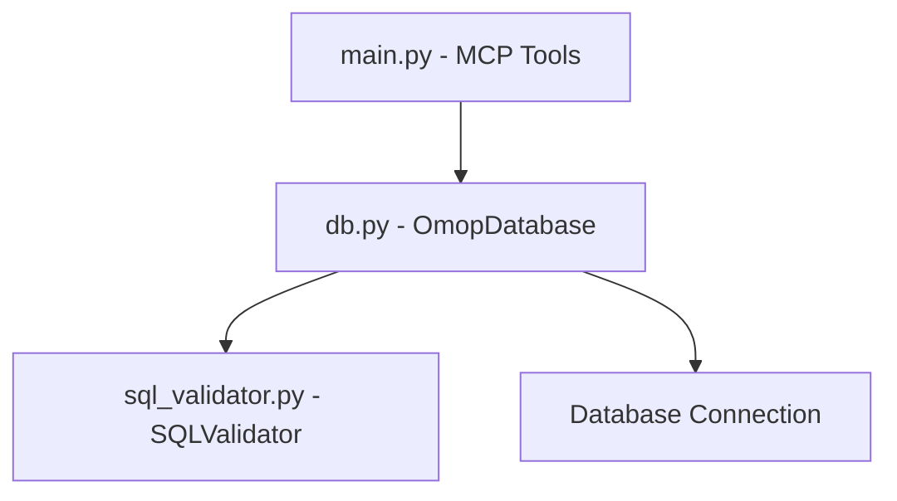

# SQL Tools Overview

The OMCP project provides robust SQL query capabilities specifically designed for working with the OMOP Common Data Model (CDM). These tools allow you to safely query OMOP databases while enforcing security policies and validation rules.

## Architecture

The SQL tools system consists of three primary components:



1. **MCP Tools (`main.py`)** - Exposes SQL functionality as Model Context Protocol (MCP) tools
2. **Database Layer (`db.py`)** - Manages database connections and query execution
3. **SQL Validator (`sql_validator.py`)** - Ensures queries meet security and schema requirements

## Available Tools

OMCP exposes two main SQL-related tools via the MCP interface:

### Get_Information_Schema

Retrieves metadata about the available tables and columns in the OMOP database.

```python
@mcp_app.tool(
    name="Get_Information_Schema",
    description="Get the information schema of the OMOP database."
)
def get_information_schema() -> mcp.types.CallToolResult:
    # ...implementation...
```

### Select_Query

Executes SELECT queries against the OMOP database, with validation.

```python
@mcp_app.tool(
    name="Select_Query",
    description="Execute a select query against the OMOP database."
)
def read_query(query: str) -> mcp.types.CallToolResult:
    # ...implementation...
```

## Security Features

The SQL tools implement several security measures:

- **SQL Validation** - Only SELECT statements are allowed
- **Schema Restriction** - Queries are limited to approved OMOP tables
- **Column Filtering** - Sensitive columns can be blocked
- **Row Limiting** - Results are limited to prevent resource exhaustion

## Supported Databases

Currently, the following databases are fully supported:

- DuckDB (default)

Future support is planned for:
- PostgreSQL
- And potentially other database systems

For more detailed information about each component, see the following pages:

- [SQL Validation](./validation.md) - Details on how queries are validated
- [Query Execution](./execution.md) - How queries are executed against the database
